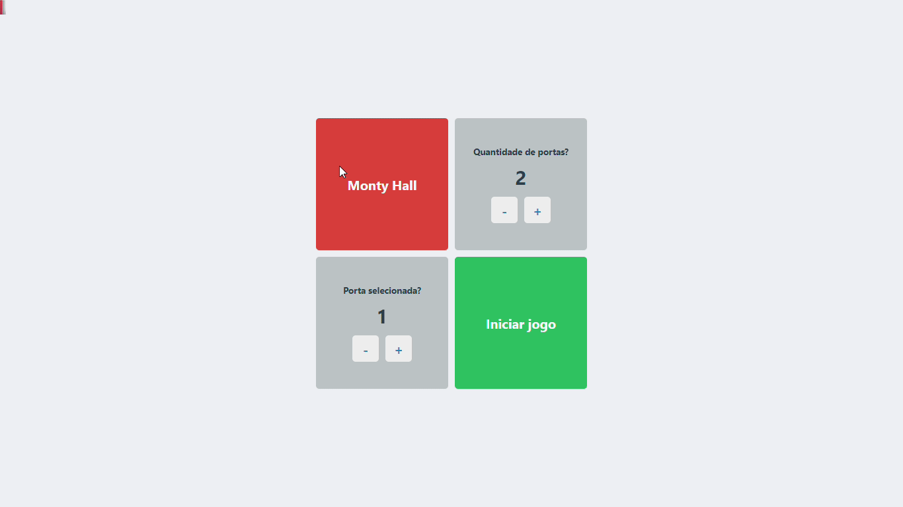
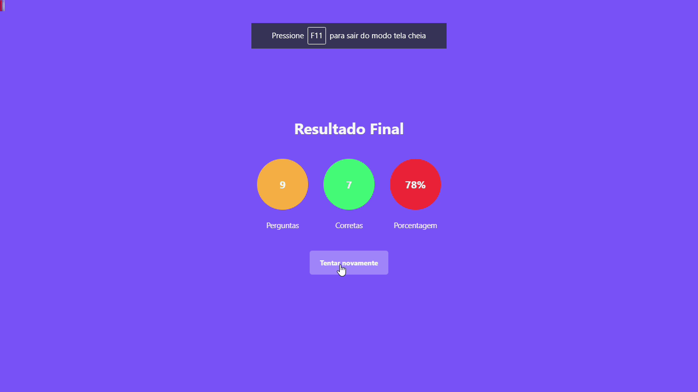

## Curso React e Next.js

Repositório dedicado aos projetos desenvolvidos durante um curso de React e Next.js disponível na Udemy.

##### Progresso:

- [x] Seção 1 - Introdução
- [x] Seção 2 - Revisão React
- [x] Seção 3 - Fundamentos de Next.js
- [x] Seção 4 - Projeto Porta Premiada
- [x] Seção 5 - Modos de pré renderização do Next.js
- [x] Seção 6 - Projeto Quiz
- [x] Seção 7 - Deploy na nuvem
- [x] Seção 8 - Projeto Template Admin
- [ ] Seção 9 - Projeto final
- [ ] Seção 9 - Bônus: ententendo TypeScript

#### Projeto Porta Premiada - <a href="https://monty-hall-rho.vercel.app/">Preview</a>

#### Projeto Quiz - <a href="https://quiz-theta-drab.vercel.app/">Preview</a>

#### Projeto Admin Template - <a href="https://github.com/luizsp7m/email-manager/">Preview</a>

